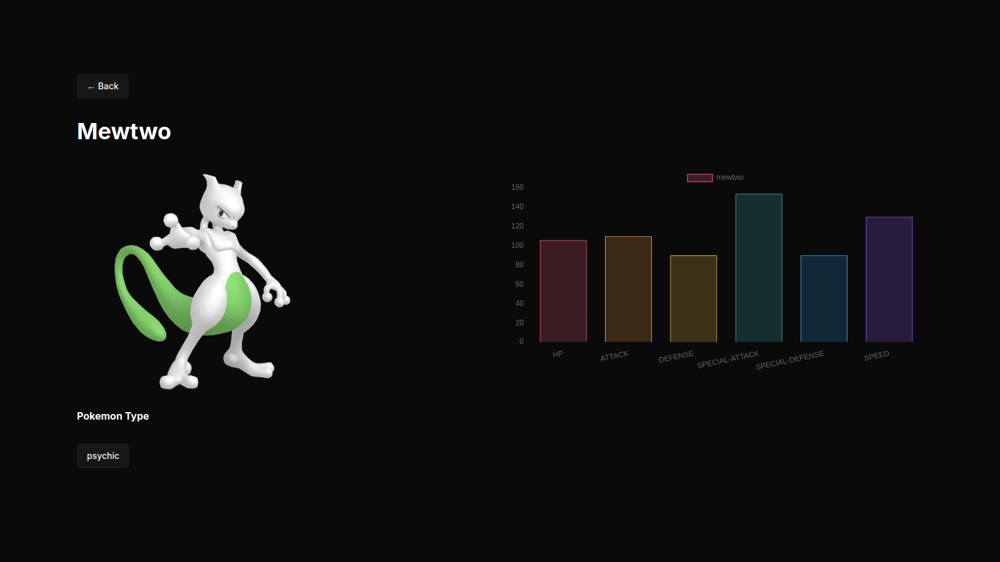
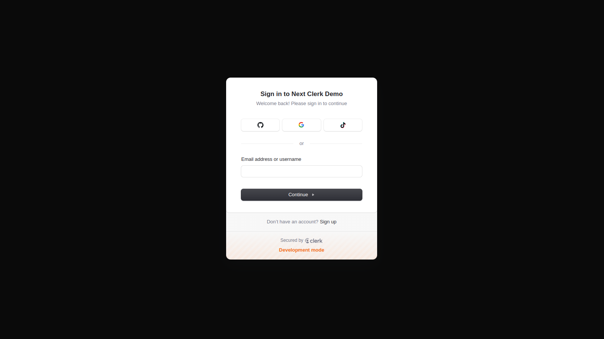
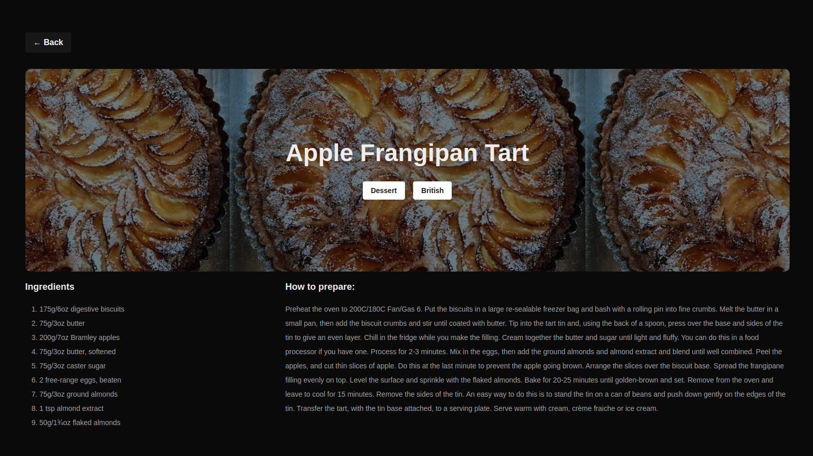
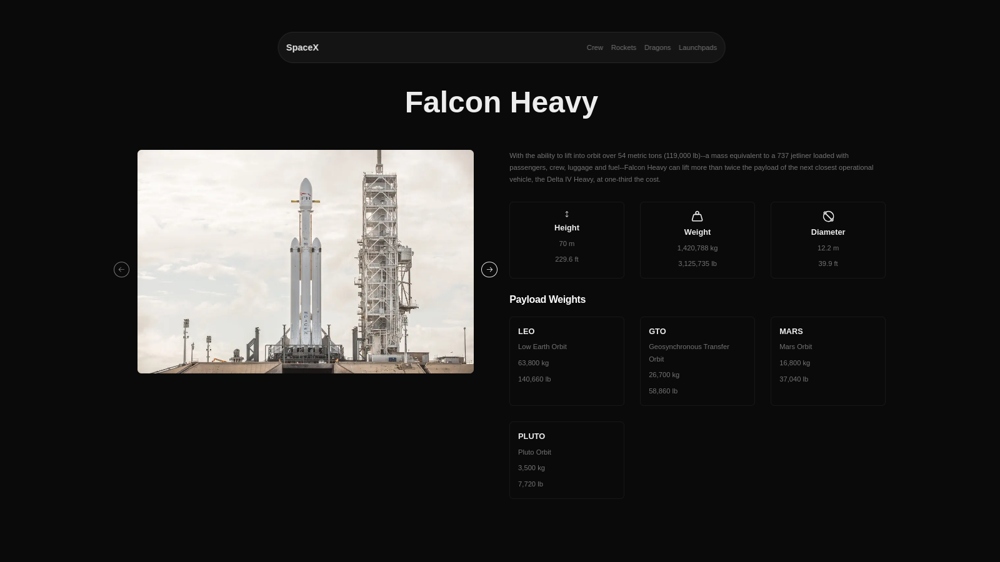
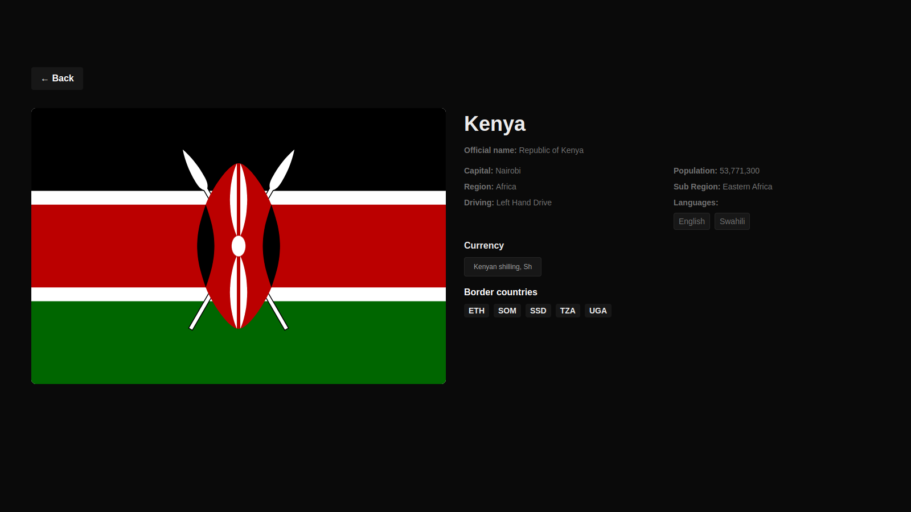

# Welcome

Welcome to building 10 NextJS projects with [me](https://youtube.com/tsbsankara). Here is an outline of the projects we are going to build:

### 1. An e-commerce website using Sanity CMS


- We will build a mock up of an ecommerce website with Sanity Studio as the backend.

### 2. Image Gallery with Search


- Using the Unsplash API, we will build an image gallery with internal routing for individual images, and search functionality to get other images.

### 3. Pokedex



- We will use [the PokeAPI](https://pokeapi.co) to get and display data about various Pokemon.

### 4. Authentication using Clerk



- We will use the GitHub users API to build a dashboard with log in and sign up pages powered by Clerk Authentication. You will be able to see and manage users from your backend.

### 5. Authentication using Kinde


- We will use the Fakestore API to build a storefront that is protected by Kinde Authentication for users to log in and sign up.

### 6. Food Recipe App



- We will build an awesome Food / Meal app that will show meal categories, various meals depending on a category, and meal recipes. All this will be powered by [The Meal DB API](https://themealdb.com).

### 7. Link Sharing App


- We will build a link sharing app similar to Linktree where users will be able to add new links, edit links, upload profile images, and preview the finished links. For this, we will implement the Context API.
- Challenge: Integrate Clerk or Kinde Authentication in this application so that users get custom links to share out on social media.

### 8. SpaceX Web App



- We will use [the SpaceX Data API](https://api.spacexdata.com/v4/company) to create this awesome website which has multiple pages and functionality.

### 9. Countries App



- [The Restcountries API](https://restcountries.com/) is a popular API containing all the countries data. We will use this API to build this amazing web app with internal routing, single country page route, search, and filter functionality.

### 10. Sports App


- The final project uses [The SportsDB API](https://thesportsdb.com) to get data about various leagues, teams and sports in the world. Using this data, we will build a beautiful user interface with NextJS.

## Before beginning building

We will go through the following before we can begin typing away building projects in order that someone who is coming in completely new won't be absolutely lost.

1. How NextJs works
2. Rendering items and components
3. Server and Client components
4. File-based routing
5. Layouts
6. Route groups
7. Metadata

We will also use the **app router** as opposed to the **pages router**.

> [The NextJS docs](https://nextjs.org) are a good place to start if you want more information about these topics.

## Requirements for the course

1. A good understanding of HTML, CSS and JavaScript. Here is a [JavaScript refresher course](https://developer.mozilla.org/en-US/docs/Web/JavaScript/Language_overview) on MDN.
2. [NodeJs](https://nodejs.org) installed on your machine to be able to run JavaScript outside of the browser.
3. [Git](https://git-scm.com) installed on your system to make git commits.
4. A code editor such as [VSCode](https://code.visualstudio.com), [Atom](https://atom-editor.cc/), [Webstorm](https://www.jetbrains.com/webstorm/download/) or any other you would prefer.
5. A [GitHub account](https://github.com) to access and download source code.

## React Foundations Course

If you're are coming in completely new from HTML, CSS and JavaScript, [here is a link](https://nextjs.org/learn/react-foundations) to the NextJs React Foundations course which does a good job of introducting core concepts and migrating from HTML to React to NextJs.

## Software versions at the time of recording

These are the versions I am running at the time of recording. Take note of them because new versions are constantly being put out and might work differently if you are building these applications in the future.

1. NodeJS - 22.6.0 (I use the Current version as opposed to the Long Term Support (LTS) version)
2. npm - 10.8.3
3. npx - 10.8.3
4. git - 2.43.0
5. NextJs - 14.2.x

## Plugins we will use

### 1. TailwindCSS

---

We will style all our applications using TailwindCSS. However, you are free to use any other styling option available to you, because the purpose of this course is to showcase the power and functionality of NextJS - It is not a TailwindCSS course.

I only happen to prefer tailwindCSS because it speeds up development for me, and we can install it easily when creating a NextJS application.

> With the same breath, we will use JavaScript throughout the course because I don't know TypeScript, as surprising as that might be - which is not to mean that I would use TypeScript if I did know it. Perhaps I might, but we don't know exactly what I would do at this point.

### 2. Prettier plugin for TailwindCSS

---

We are going to use the following plugin throughout our projects because it will help us to format tailwind classes using the TailwindCSS convention. To install it, run the following command in your terminal, making sure you are in the correct project folder.

```
npm install -D prettier prettier-plugin-tailwindcss
```

#### Create `.prettierrc` file and paste in the following:

After installing it, create a `.prettierrc` file in the root of your workspace and paste in the following line:

```
{
  "plugins": ["prettier-plugin-tailwindcss"]
}
```

And then you can begin typing away and your classes will be formatted when you save the file.

> The above configuration assumes that you have your `tailwind.config.js` or `tailwind.config.ts` file in the same location as your `.prettierrc` file. If that is not the case you will need some additional configuration which [you can find here](https://github.com/tailwindlabs/prettier-plugin-tailwindcss). Also note that this only works if you have **format on save** enabled, and you have the **Prettier Code Formatter** installed. So if it doesn't work right away, check the above two items.

### 3. ShadCN UI

---

ShadCN is an amazing component library which will give us access to nicely styled components to use in our application. [Check it out](https://ui.shadcn.com)

## Disclaimer

The apps we build in the videos might not be exact 1:1 matches for the previews shown above in terms of styling. All the other functionality, however, will be the same. Feel free to change up the styling to suit your themes however you want.

### Follow me on social media

---

1. [YouTube](https://youtube.com/tsbsankara)
2. [X (formerly Twitter)](https://x.com/tsbsankara)
3. [Website](https://tsbsankara.netlify.app)
4. [Gumroad](https://tsbsankara.gumroad.com)
5. [Tutorialspoint](https://www.tutorialspoint.com/lets-build-20-reactjs-projects/index.asp)
6. [Ko-Fi](https://ko-fi.com/tsbsankara)

Producing all this content takes a lot of time and energy so any kind of support goes a long way. You can buy me a coffee [here](https://ko-fi.com/tsbsankara).
